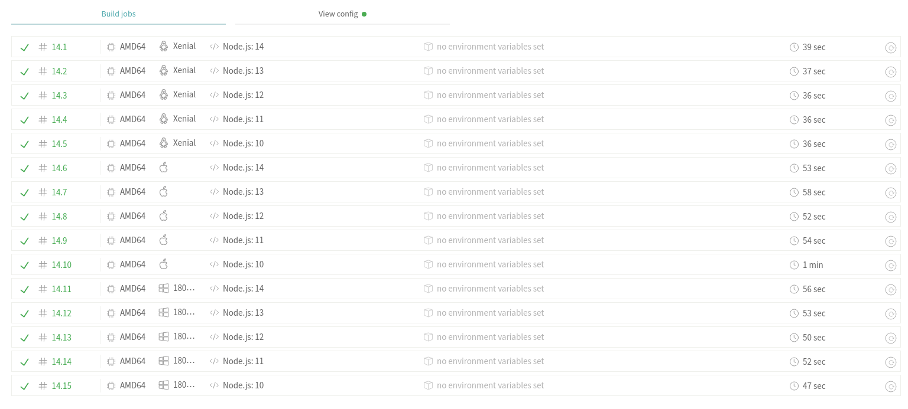

# Integración Continua

## GitHub Actions

He dejado la Integración Continua con `GitHub Actions` porque es la única con la que me aseguro de tener siempre la última versión del contenedor que contiene el entorno para ejecutar los tests. Además, me ahorro de estar haciendo builds innecesarios, solo se hacen los builds y push de la imagen del `Dockerfile` cada vez que hay un commit que edita el mismo o el `package.json`.

Los workflows implementados son los siguientes:
- [linters](https://github.com/ManuelJNunez/footStats/blob/master/.github/workflows/linters.yml). Para checkear que la sintaxis y el estilo de todo el código implementado en TypeScript y que los Dockerfiles son correctos.
- [check-ortography](https://github.com/ManuelJNunez/footStats/blob/master/.github/workflows/check-ortography.yml). Para comprobar que no se han producido ninguna falta de ortografía en este fichero que estás leyendo ahora mismo.
- [dockerci](https://github.com/ManuelJNunez/footStats/blob/master/.github/workflows/dockerci.yml). Detecta si hay cambios en el Dockerfile y si los hay, lo construye y actualiza la imagen del contenedor de GHCR. Después ejecuta el contenedor (que a su vez ejecuta los tests) para comprobar que el código funciona correctamente.

## Travis

`Travis` lo he configurado para poder probar si la aplicación se puede ejecutar en distintas versiones de `node` y de forma paralela para ahorrar tiempo de espera. Las versiones en las que funciona la aplicación son las que aparecen en el fichero de configuración de `Travis`. Dicho fichero se encuentra [aquí](https://github.com/ManuelJNunez/footStats/blob/master/.travis.yml).

No he puesto ninguna configuración para usar caché, ya que se supone que viene activado por defecto para `npm`. Checkear [aquí](https://docs.travis-ci.com/user/languages/javascript-with-nodejs/).

Además también probé con `Travis` si la aplicación funcionaba en distintos Sistemas Operativos además de en Linux (`osx` y `Windows`), pero tardaba 4 minutos y los quité. La siguiente imagen demuestra que he probado los SOs.

## CircleCI
`CircleCI` lo he usado para poder ejecutar los tests unitarios y de cobertura de forma rápida. Tengo que decir que había probado `Shippable` antes que este por ser no solo un servicio de CI, sino una herramienta de DevOps que permite el CD a varias plataformas, lo cuál sería útil para el futuro. Además puede recoger el report de los tests de cobertura, pero tardaba 2 minutos en ejecutar los tests y pensé que es demasiado. Además, `Shippable` usa versiones no tan actualizadas de `node` como `CircleCI`. Este último es muy rápido, suele tardar únicamente 20 segundos en ejecutar los tests unitarios, los tests de cobertura y de subir los resultados a `codecov`. El fichero de configuración se encuentra [aquí](https://github.com/ManuelJNunez/footStats/blob/master/.circleci/config.yml).

Se puede ver en el fichero de configuración de CircleCI que se está usando caché para los `node_modules`.

Para poder ejecutar los tests de cobertura y hacer un reportar los resultados hacia `codecov` se han añadido nuevas tareas al task runner:

    npm run coverage

    npm run coverage-report

Además de otra tarea para generar la documentación (aunque esto no sirva para CI)

    npm run doc

# Avance en el proyecto

En el proyecto se han hecho los siguientes cambios:

- Se han añadido las interfaces que representan los prototipos de los objetos JSON que devolverán las clases. Las interfaces son las siguientes
  - [UsuarioI](https://github.com/ManuelJNunez/footStats/blob/master/src/interfaces/usuario.interface.ts)
  - [PartidoI](https://github.com/ManuelJNunez/footStats/blob/master/src/interfaces/partido.interface.ts)
  - [JugadaI](https://github.com/ManuelJNunez/footStats/blob/master/src/interfaces/jugada.interface.ts)
- Se ha documentado todo el código usando el estándar de comentarios `tsdoc` y se puede generar la documentación con `TypeDoc`. Además de las interfaces de arriba, se han documentado las clases.
- Se ha quitado TypeORM de la definición de las clases, para separar la lógica de negocio del almacenamiento. Por tanto se han privatizado las variables y se han añadido los getters y setters necesarios.
- Se han añadido los métodos toJSON a todas las clases, que devuelven objetos JSON con la estructura de las interfaces antes mencionadas. Esto se ha hecho así porque se va a implementar próximamente la API REST, que trabaja enviando objetos JSON a través de HTTP. Posteriormente se han testado.
- Se ha cambiado la orden `npm install` del [Dockerfile](https://github.com/ManuelJNunez/footStats/blob/master/Dockerfile) a `npm ci` porque es más rápida instalando las dependencias.

Enlaces a las clases y sus tests:
| **Clase** |                                             **Definición**                                            |                                            **Tests**                                           |
|:---------:|:-----------------------------------------------------------------------------------------------------:|:----------------------------------------------------------------------------------------------:|
|  Usuario  | [usuario.model.ts](https://github.com/ManuelJNunez/footStats/blob/master/src/models/usuario.model.ts) | [usuario.test.ts](https://github.com/ManuelJNunez/footStats/blob/master/tests/usuario.test.ts) |
|  Partido  | [partido.model.ts](https://github.com/ManuelJNunez/footStats/blob/master/src/models/partido.model.ts) | [partido.test.ts](https://github.com/ManuelJNunez/footStats/blob/master/tests/partido.test.ts) |
|   Jugada  |  [jugada.model.ts](https://github.com/ManuelJNunez/footStats/blob/master/src/models/jugada.model.ts) |  [jugada.test.ts](https://github.com/ManuelJNunez/footStats/blob/master/tests/jugada.test.ts)  |

