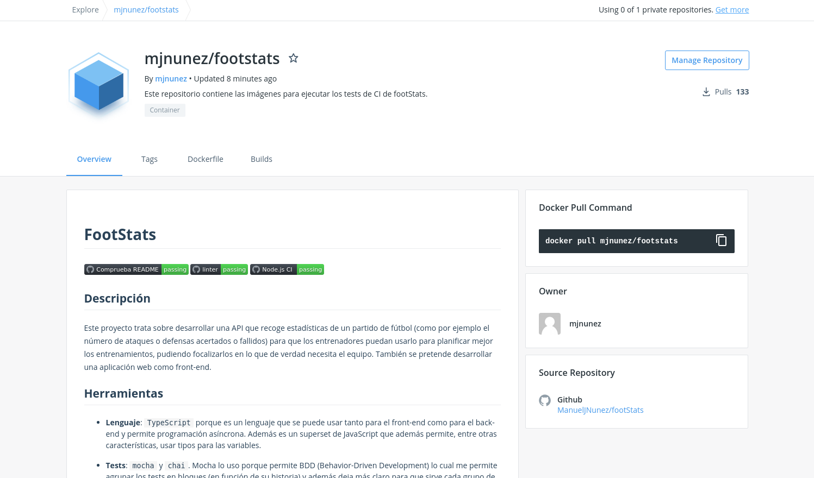
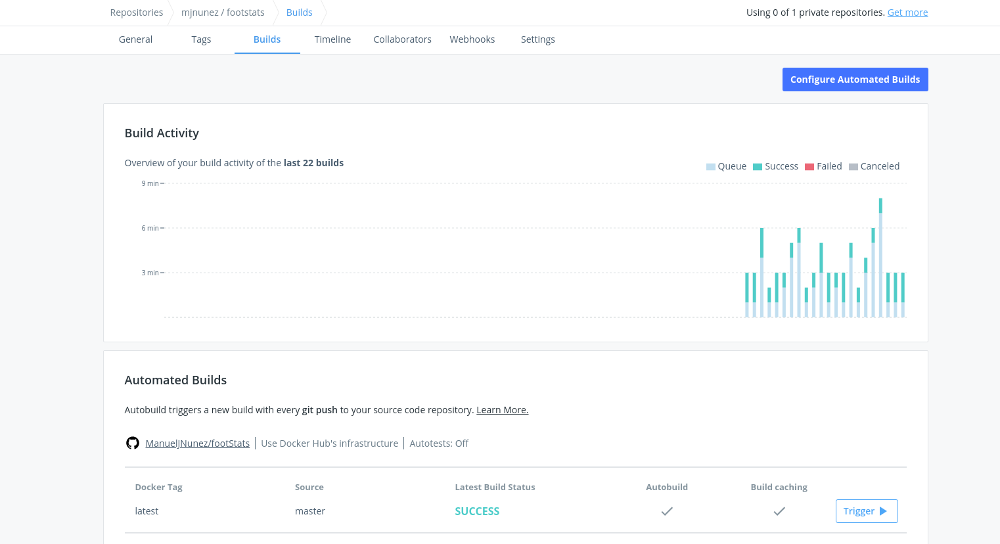
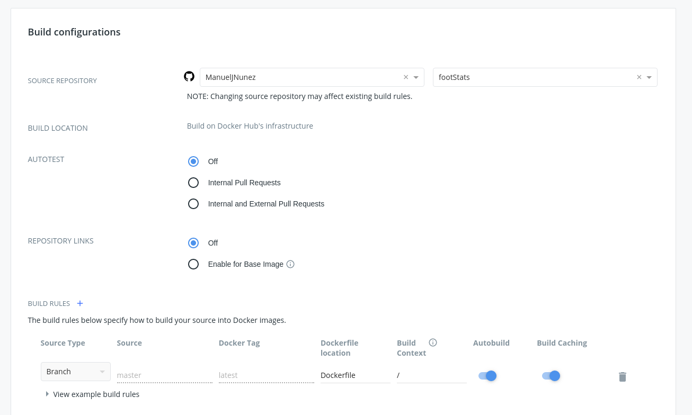
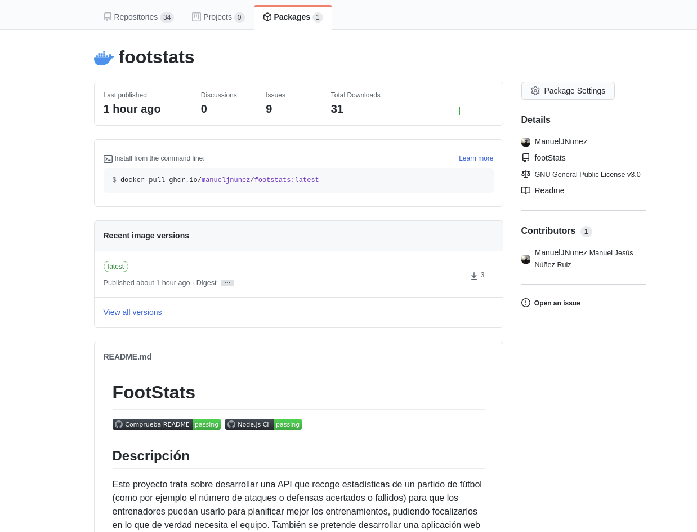
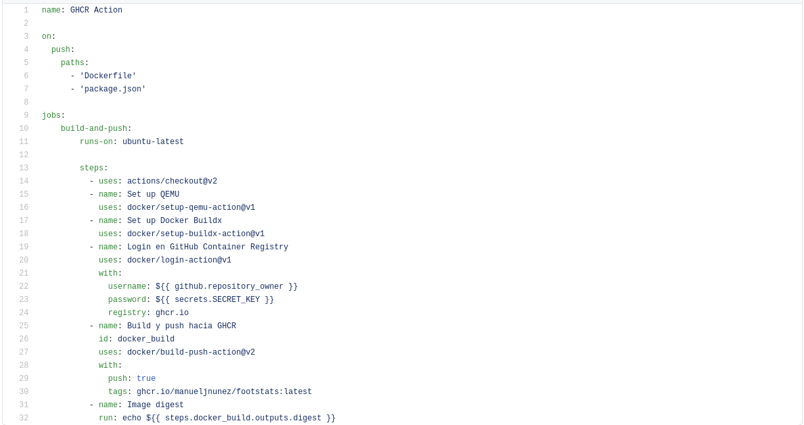

# Documentación sobre Docker

## Imágenes probadas
Se han probado varias imágenes, todas ellas generadas mediante un Dockerfile siguiendo las [mejores prácticas de Docker](https://docs.docker.com/develop/develop-images/dockerfile_best-practices/) y testeando el Dockerfile con la [GitHub Action](https://github.com/ManuelJNunez/footStats/blob/master/.github/workflows/linters.yml) correspondiente.

### alpine:latest
Alpine es una imagen de Linux muy ligera y básica (solo pesa 5.57MB) y debido a eso, es de las más usadas. El contenedor que he construido sobre esta imagen ha sido generado usando una construcción multietapa (esto ayuda a que el contenedor construido sea más ligero).

~~~dockerfile
FROM alpine:3.12.1 AS base
#Creación de grupo y usuario node. Instalación de node y npm
RUN addgroup -S node && adduser -S node -G node \
    && apk add --no-cache --update nodejs-dev=12.18.4-r0 npm=12.18.4-r0 \
    && node -v \
    && npm -v \
    && mkdir /node_modules && chown node:node /node_modules

# Cambio a un usuario no privilegiado
USER node

FROM base AS dependencies
# Cambio al directorio donde guardaré las dependencias de la aplicación
WORKDIR /

#Copia de los archivos de dependencias
COPY package.json package-lock.json ./

# Instalación de las dependencias de la aplicación
RUN npm install --silent --progress=false --no-optional

FROM base AS test
#Copiando los node_modules desde un stage anterior
COPY --from=dependencies /node_modules /node_modules

#Creación del volumen
VOLUME ["/test"]
WORKDIR /test

#PATH del node_modules
ENV PATH=/node_modules/.bin:$PATH

#Ejecución de los tests
CMD ["npm", "test"]
~~~

En la primera etapa (base), se instala node y npm, la opción `--no-cache` evita que apk cree archivos adicionales de cache en el contenedor, ya que nos conviene que este solo contenga lo básico para funcionar para que el contenedor final ocupe lo menos posible.

En la segunda etapa (dependencies) se copian los archivos `package.json` y `package-lock.json` para poder instalar las dependencias de la aplicación. La opción `--no-optional` sirve para que no instale dependencias que solo sean opcionales con el fin de ahorrar en el tamaño de la imagen final.

En la etapa final (test), se copian los módulos de node generados en la etapa anterior. Después se cambia el directorio de trabajo a `/test` y se edita una variable de entorno para que npm use los `node_modules` de otro path (tal y como se indica [aquí](https://www.docker.com/blog/keep-nodejs-rockin-in-docker/)).

La imagen final ocupa 173MB.

### ubuntu:latest
Ubuntu es una imagen más pesada que alpine (ocupa 72,9MB), aunque también se usa bastante. En este caso también he usado construcción multi etapa.

~~~dockerfile
FROM ubuntu AS base

#Creación de grupo y usuario node. Instalación de node y npm
RUN groupadd --gid 1000 node \
    && useradd --uid 1000 --gid node --shell /bin/bash --create-home node \
    && apt-get update \
    && apt-get install -y curl \
    && curl -sL https://deb.nodesource.com/setup_12.x | bash \
    && apt-get install -y nodejs \
    && rm -rf /var/lib/apt/lists/* \
    && node -v \
    && npm -v \
    && mkdir /node_modules && chown -R node:node /node_modules

# Cambio a usuario no privilegiado
USER node

FROM base AS dependencies
# Cambio al directorio donde guardaré las dependencias de la aplicación
WORKDIR /

#Copia de los archivos de dependencias
COPY package.json package-lock.json ./

# Instalación de las dependencias de la aplicación
RUN npm install --silent --progress=false --no-optional

FROM base AS test
#Copiando los node_modules desde un stage anterior
COPY --from=dependencies /node_modules /node_modules

#Creación del volumen
VOLUME ["/test"]
WORKDIR /test

#PATH del node_modules
ENV PATH=/node_modules/.bin:$PATH

#Ejecución de los tests
CMD ["npm", "test"]
~~~

En la primera etapa se instala curl para poder descargar la última LTS de node, posteriormente se limpia la cache del gestor de paquetes de ubuntu para que la imagen final ocupe lo menos posible. En las demás etapas se hace lo mismo que en alpine.

La imagen final ocupa 317MB.

### node:lts
Esta imagen es la más pesada de las cuatro que he probado (ocupa 918MB), contiene la última versión LTS de node.

~~~dockerfile
FROM node:lts AS base

#Creación del directorio donde se guardarán las librerías de node
RUN mkdir /node_modules && chown -R node:node /node_modules

# Cambio a usuario no privilegiado
USER node

FROM base as dependencies

# Cambio al directorio donde guardaré las dependencias de la aplicación
WORKDIR /

#Copia de los archivos de dependencias
COPY package.json package-lock.json ./

# Instalación de las dependencias de la aplicación
RUN npm install --silent --progress=false --no-optional

FROM base AS test

#Copiando los node_modules desde un stage anterior
COPY --from=dependencies /node_modules /node_modules

#Creación del volumen
VOLUME ["/test"]
WORKDIR /test

#PATH del node_modules
ENV PATH=/node_modules/.bin:$PATH

#Ejecución de los tests
CMD ["npm", "test"]
~~~

El contenedor generado ocupa 1.03GB.

### node:lts-alpine
Esta imagen contiene la última versión LTS de node en alpine y es la más recomendada si deseamos una imagen pequeña, como en este caso. La imagen original ocupa 89.6MB.

~~~dockerfile
FROM node:lts-alpine AS base

#Creación del directorio donde se guardarán las librerías de node
RUN mkdir /node_modules && chown -R node:node /node_modules

# Cambio a usuario no privilegiado
USER node

FROM base as dependencies

# Cambio al directorio donde guardaré las dependencias de la aplicación
WORKDIR /

#Copia de los archivos de dependencias
COPY package.json package-lock.json ./

# Instalación de las dependencias de la aplicación
RUN npm install --silent --progress=false --no-optional

FROM base AS test

#Copiando los node_modules desde un stage anterior
COPY --from=dependencies /node_modules /node_modules

#Creación del volumen
VOLUME ["/test"]
WORKDIR /test

#PATH del node_modules
ENV PATH=/node_modules/.bin:$PATH

#Ejecución de los tests
CMD ["npm", "test"]
~~~

La imagen final ocupa 207MB.

## Pruebas de distintas imágenes
Se han hecho cuatro pruebas para cada contenedor del tiempo que tardan en descargar y construir el contenedor y ejecutar los tests (lógicamente después de cada descargar eliminaba las imágenes locales).

~~~shell
time docker run -t -v `pwd`:/test mjnunez/footstats:tag
~~~

|    **Imagen**   | **Tiempo 1** | **Tiempo 2** | **Tiempo 3** | **Tiempo 4** | **Tiempo medio** |
|:---------------:|:------------:|:------------:|:------------:|:------------:|:----------------:|
|     node:lts    |    89,88s    |    80,95s    |    75,35s    |    84,94s    |      82,78s      |
| node:lts-alpine |    25,005s   |    17,621s   |    20,035s   |    17,501s   |      20,04s      |
|  ubuntu:latest  |    32,443s   |    39,156s   |    28,826s   |    28,574s   |      32,25s      |
|  alpine:latest  |    17,782s   |    17,985s   |    18,664s   |    18,348s   |      18,195s     |

Como podemos ver, de media es mejor el contenedor cuya imagen base es alpine:latest, que también es el contenedor más ligero de los 4. Por tanto elijo ese para ejecutar los tests del código del repositorio.

## Linter

Se ha añadido un workflow que ejecuta un linter para el Dockerfile y así poder asegurarme de que es correcto. Esta puede verse [aquí](https://github.com/ManuelJNunez/footStats/blob/master/.github/workflows/linters.yml).

## Configuración de las autobuilds
### DockerHub

He configurado el build en el repositorio de DockerHub para que cada vez que se haga un push que modifique el Dockerfile, se realice una build y un push del contenedor hacia DockerHub. En este imagen se puede ver como se ha sincronizado el README.

Para ello me he ido a la pestaña de `Build`, he enlazado mi cuenta de GitHub con la de DockerHub y he activado el `Build`, de tal forma que se haga un build y un push (con el tag `latest`) cada vez que se modifique el fichero Dockerfile de la rama master.

### GitHub Container Registry

También he enlazado un contenedor de GHCR al repositorio.

Y he configurado un Workflow para que cada vez que se haga un cambio en el Dockerfile o en las dependencias del `package.json`, se haga una build y un push hacia el repositorio de GHCR para actualizar la imagen.

