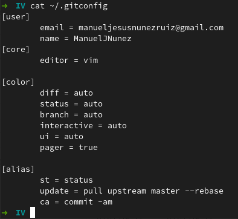
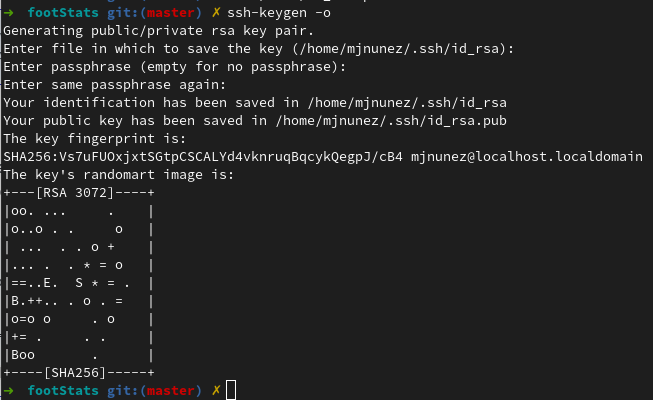
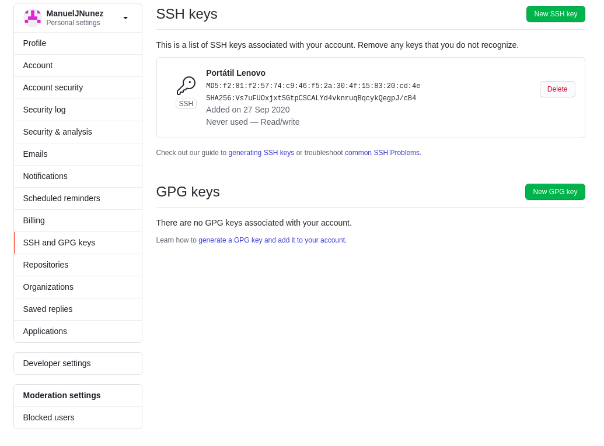
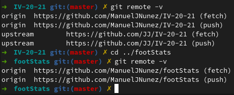

# Creación y preparación del repositorio de GitHub y configuración de git
Lo primero que he hecho ha sido configurar git en mi PC. Para ello he editado el archivo `~/.gitconfig` y lo que dejado como se ve en la imagen de abajo.

Después he creado el siguiente repo:
- [footStats](https://github.com/ManuelJNunez/footStats)

Al cual le he añadido la licencia (GPLv3.0 en este caso), el archivo .gitignore configurado para `node`, `VSCode`, y `yarn` y el README con información sobre el proyecto.

Después de crearlo he creado un par de claves y he subido a GitHub la clave pública

También he realiado el fork del repositorio de la asignatura (IV20-21) y he configurado los repositorios remotos de la siguiente manera en mi PC
