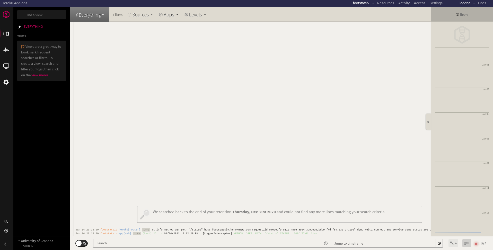

# Despliegue del microservicio en Heroku

## Descripción y justificación de las herramientas usadas para desplegar la aplicación en el PaaS.

He usado Heroku para el despliegue del microservicio por varias razones. Las principales han sido por ser gratuito y tener una CLI bastante simple y fácil de manejar. Además de lo anterior, permite añadirle addons, como por ejemplo una base de datos postgre (la que he usado yo) y conectarlo con plataformas de logging (como por ejemplo `logDNA`).

La aplicación la he desplegado usando el fichero [heroku.yml](https://github.com/ManuelJNunez/footStats/blob/master/heroku.yml) el cual me permite el despliegue de un contenedor (así aprovecho el que creé en el hito anterior [Dockerfile.web](https://github.com/ManuelJNunez/footStats/blob/master/Dockerfile.web)) y además he añadido una base de datos postgre a la dyno sin tener que añadirla a mano. El despliegue se ha hecho siguiendo [estas instrucciones](https://devcenter.heroku.com/articles/build-docker-images-heroku-yml).

Para las pruebas locales del microservicio he usado `heroku local` para evitar despliegues que no funcionen y me hagan perder el tiempo.

Gracias a las órdenes de heroku pg, he podido provisionar la base de datos postgre usando `heroku pg:push LOCAL_DATABASE DATABASE_URL --app APP` tal y como se indica en la [documentación oficial](https://devcenter.heroku.com/articles/heroku-postgresql).

## Descripción correcta de la configuración para despliegue automático, desde el repositorio o desde el sistema de integración continua.

Para el despliegue automático en Heroku, he implementado el workflow [Heroku CD](https://github.com/ManuelJNunez/footStats/blob/master/.github/workflows/herokucd.yml), el cual se ejecuta después de los tests si estos se pasan correctamente.

## Buenas prácticas del diseño de la API.

Para el correcto diseño de la API me he basado en la documentación de NestJS para asegurar las buenas prácticas en el diseño de la misma.

- Las rutas de Usuario se encuentran en [usuario.controller.ts](https://github.com/ManuelJNunez/footStats/blob/master/src/usuario/usuario.controller.ts) (tests del controller [aquí](https://github.com/ManuelJNunez/footStats/blob/master/src/usuario/usuario.controller.spec.ts)). El controller hace uso de [usuario.service.ts](https://github.com/ManuelJNunez/footStats/blob/master/src/usuario/usuario.service.ts), que se encarga del almacenamiento de los datos (los tests del service se encuentran [aquí](https://github.com/ManuelJNunez/footStats/blob/master/src/usuario/usuario.service.spec.ts), he hecho un mock para el pool de postgre). Esto se corresponde con la [HU0](https://github.com/ManuelJNunez/footStats/issues/3) y la [HU1](https://github.com/ManuelJNunez/footStats/issues/4).
- Las rutas de Partido se encuentran en [partido.controller.ts](https://github.com/ManuelJNunez/footStats/blob/master/src/partido/partido.controller.ts) (tests del controller [aquí](https://github.com/ManuelJNunez/footStats/blob/master/src/partido/partido.controller.spec.ts)). El controller hace uso de [partido.service.ts](https://github.com/ManuelJNunez/footStats/blob/master/src/partido/partido.service.ts), que se encarga del almacenamiento de los datos (los tests del service se encuentran [aquí](https://github.com/ManuelJNunez/footStats/blob/master/src/partido/partido.service.spec.ts), he hecho un mock para el pool de postgre). Esto se corresponde con la [HU2](https://github.com/ManuelJNunez/footStats/issues/5) y la [HU3](https://github.com/ManuelJNunez/footStats/issues/6).

Además de lo anterior, he actualizado los tests de integración para Usuario (se encuentran [aquí](https://github.com/ManuelJNunez/footStats/blob/master/tests/usuario.integration-spec.ts)) y he añadido los de Partido (se encuentran [aquí]((https://github.com/ManuelJNunez/footStats/blob/master/tests/partido.integration-spec.ts))). Además he añadido lo siguiente:
- Un [script SQL](https://github.com/ManuelJNunez/footStats/blob/master/database/tables.sql) para crear las tablas de la BD, tanto para producción, como para desarrollo.
- He añadido un [docker-compose.yml](https://github.com/ManuelJNunez/footStats/blob/master/docker-compose.yml) para poder hacer staging en un futuro.

Me faltaría por finalizar con la [HU4](https://github.com/ManuelJNunez/footStats/issues/7), me pondré con ella con la mayor brevedad posible, ya que tengo que tenerlo listo para la presentación.

## Uso de bases de datos y logs dentro del PaaS.

He usado `PostgreSQL` debido a que uso datos estructuras y es más indicada para producción que `MySQL`. La base de datos ha sido provisionada tal y como indiqué antes, tengo que añadir que lo hice con una BD limpia, con las tablas recién creadas. Además puedo acceder a ella desde mi PC con la orden `heroku pg:psql`. El módulo de la BD se encuentra [aquí](https://github.com/ManuelJNunez/footStats/tree/master/src/pg). La clase PgService es singleton, solo se crea una instancia, por tanto solo existe un Pool para toda la aplicación y además es inyectada en todas las clases que la usa.

Para el sistema de logs, debido a que el de Heroku los guarda durante muy poco tiempo, he conectado mediante la CLI (usando [esta guia](https://devcenter.heroku.com/articles/logdna)) con `logDNA`. He usado esa plataforma debido a los beneficios que me aporta en la misma el [pack de estudiante de GitHub](https://education.github.com/pack).

