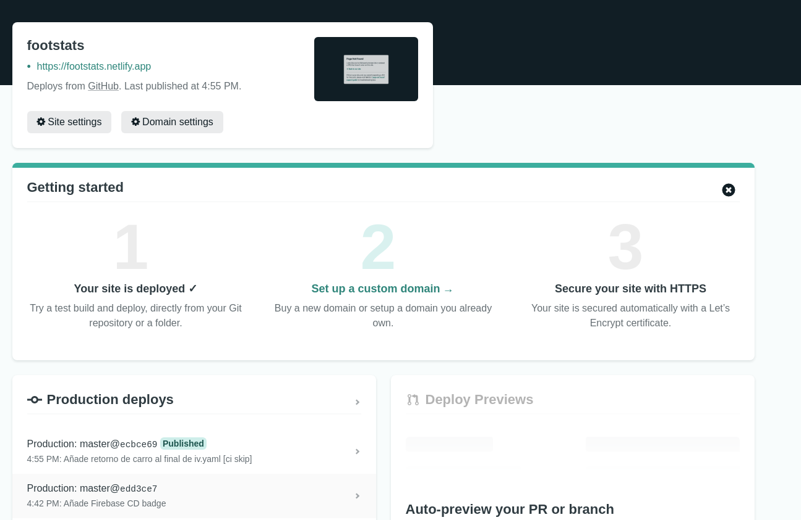

# Funciones serverless

## Netlify

Netlify lo he usado porque permite pasar parámetros (en un principio iba a usarlo, pero al final no) y porque tiene una configuración en formato .toml que queda muy clara. Además, no fuerza al usuario a tener una estructura de directorios concreta, eso se puede configurar. La conexión de netlify con el repo la hice a través de su interfaz web, en la siguiente captura se puede ver que está correctamente conectado (aunque también se puede ver en el badge del [README.md](https://github.com/ManuelJNunez/footStats#readme)).

Las funciones implementadas han sido las siguientes:
- [status](https://github.com/ManuelJNunez/footStats/blob/master/functions/status.js). Una función muy simple que sólo devuelve el código 200 y un json diciendo que la aplicación funciona. Sirve para conocer si la API funciona bien. Sus tests es encuentran [aquí](https://github.com/ManuelJNunez/footStats/blob/master/tests/status.test.ts).
- [league](https://github.com/ManuelJNunez/footStats/blob/master/functions/league.js). Toma los datos del fichero [data.json](https://github.com/ManuelJNunez/footStats/blob/master/functions/data.json) y los muestra. Este fichero contiene la clasificación de La Liga de fútbol española y esta función corresponde a esta [HU](https://github.com/ManuelJNunez/footStats/issues/67).  Sus tests se encuentran [aquí](https://github.com/ManuelJNunez/footStats/blob/master/tests/league.test.ts).
- [credits](https://github.com/ManuelJNunez/footStats/blob/master/functions/credits.js). Toma los ficheros de [credits.json](https://github.com/ManuelJNunez/footStats/blob/master/functions/credits.js) y los muestra. Este fichero contiene las personas/equipo de fútbol que han contribuido para realizar este proyecto, bien planteando el problema o solucionándolo. Sus tests se encuentran [aquí](https://github.com/ManuelJNunez/footStats/blob/master/tests/credits.test.ts).

No solamente se han implementado estas funciones, también añadí un workflow para actualizar los datos de data.json todos los días a medianoche. Dicho workflow se puede checkear [aquí](https://github.com/ManuelJNunez/footStats/blob/master/.github/workflows/updatedata.yml) y hace uso de [este pequeño script](https://github.com/ManuelJNunez/footStats/blob/master/.github/workflows/get-data.sh). Esto lo he hecho así porque la API que uso sólo me deja hacer 100 llamadas gratuitas al día, por lo que así tengo un control del número de llamadas.

He usado el [fichero de configuración de netlify](https://github.com/ManuelJNunez/footStats/blob/master/netlify.toml) para poder hacer redirecciones y dejar los URIs más cortos, además de especificarle el directorio que debe de publicar y el directorio de las funciones implementadas.

## Firebase

Esta plataforma la he usado debido a que ha sido la primera que me ha funcionado bien para desplegar un bot de Telegram. Anteriormente había probado en `Vercel` y en `Netlify`, pero no funcionaban.

Para crear la función he creado en el directorio [telegram](https://github.com/ManuelJNunez/footStats/tree/master/telegram) la estructura de ficheros necesaria para Firebase. Dentro del directorio [functions](https://github.com/ManuelJNunez/footStats/tree/master/telegram/functions) se encuentra un nuevo [package.json](https://github.com/ManuelJNunez/footStats/blob/master/telegram/functions/package.json) con las dependencias de la función. El bot que he implementado coge la información de la API de `netlify` que he implementado anteriormente para poder mostrarla en `Telegram` en forma de mensaje entendible por cualquier humano que hable español (uso el bot de interfaz para la API). Dicho bot está implementado [en este fichero](https://github.com/ManuelJNunez/footStats/blob/master/telegram/functions/index.js) usando la biblioteca `Telegraf`, porque me parece la más intuitiva de todas.

Para poder crear variables de entorno privadas, se debe de usar la CLI. Un ejemplo de creación de variable privada:

    firebase functions:config:set telegram.key="TELEGRAM_TOKEN"

Se puede conversar con el bot buscando en Telegram `@footstatsiv_bot`.

Como Firebase no permite conectarse a GitHub, he creado un [workflow](https://github.com/ManuelJNunez/footStats/blob/master/.github/workflows/firebase.yml) para hacer un despliegue continuo del bot.
